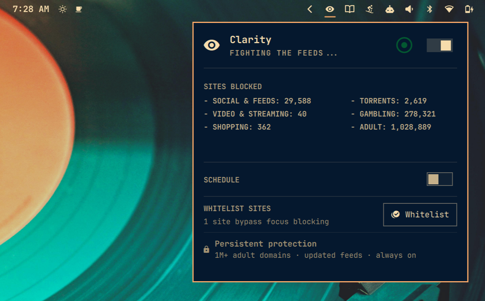
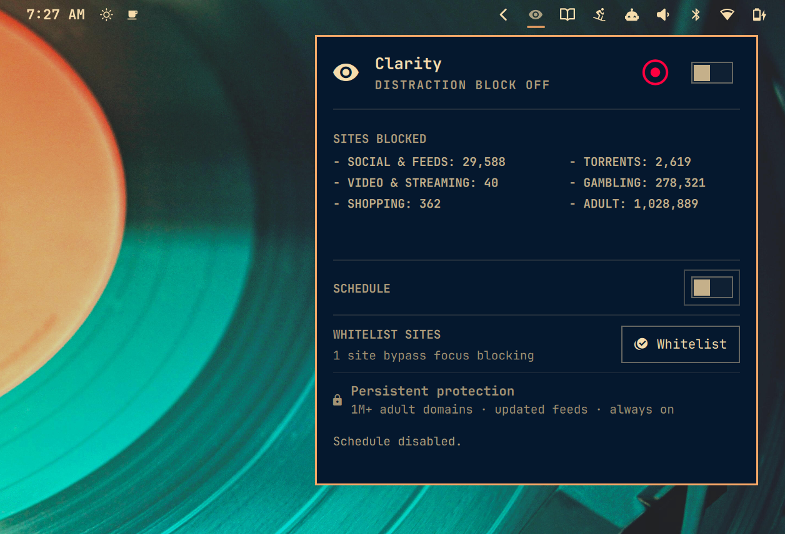

```text
                                ▄▄
                                    ██
██████  ██        ████  ██████  ██  ██████  ██  ██
██      ██      ██  ██  ██      ██  ██      ██  ██
██████  ██████  ██████  ██      ██  ████    ██████
                                                ██
by Ty Richards
```

<p align="center">
  
</p>

# omarchy-clarity

**Get Focused. Get Productive. Get Clarity.**

Clarity is a focus-driven productivity tool for Omarchy. It puts deliberate friction between you and the sites that steal your day, helping you stop scrolling, protect deep-work time, and get shit done.

<p align="center">
  
</p>

## What Clarity does

### 1. Turn distracting sites on and off—or schedule them

Clarity blocks social feeds, video, shopping, gambling, torrents, news, games, entertainment, and other output killers while focus mode is active. Use the top-bar switch when you need to focus now, or define up to three non-overlapping daily focus windows—including overnight and all-day schedules.

A unique Clarity password—not your Linux login password—is required to turn focus blocking off or alter its schedule and whitelist. Many people have a trusted friend create and hold that password for extra friction.

<p align="center">
  
</p>

The focus layer merges ten maintained category feeds with an aggressive bundled catalog covering:

- Social networks and infinite feeds
- YouTube and other video platforms
- Facebook, TikTok, X/Twitter, and WhatsApp infrastructure
- Gambling and torrent sites
- Amazon retail, Prime Video, Audible, IMDb, Goodreads, and international storefronts
- Shopping, auctions, deal hunting, and marketplaces
- Streaming video and livestreams
- News cycles, opinion feeds, newsletters, forums, and viral content
- Sports, gaming, dating, food delivery, gossip, memes, and other rabbit holes

The main Clarity switch and schedule control only this productivity-focused layer. Its remote feeds refresh weekly.

### 2. Optionally block adult sites persistently

During setup, Clarity asks whether to enable a separate persistent adult blacklist. If selected, it stays active regardless of the main switch or focus schedule and remains until Clarity is uninstalled. If skipped, no adult feed is downloaded or applied. You can later enable it from the bottom of the Clarity panel with a two-click confirmation; once enabled, it likewise remains until uninstall.

Clarity downloads, validates, merges, and de-duplicates three well-maintained feeds:

- [Block List Project Porn](https://github.com/blocklistproject/Lists)
- [HaGeZi NSFW](https://github.com/hagezi/dns-blocklists)
- [StevenBlack `porn-only`](https://github.com/StevenBlack/hosts/tree/master/alternates/porn-only)

The merged list is normally around one million unique domains. No finite blacklist can guarantee every present and future adult domain; this is a massive, regularly refreshed best-effort merge.

## Whitelist what you still need

Clarity automatically allows productivity-friendly music and podcast services such as Spotify, Apple Music, YouTube Music, SoundCloud, Bandcamp, Pocket Casts, and Overcast. General YouTube remains blocked. The maintained defaults live in `config/focus-allowlist.txt` and are applied on every fresh install and upgrade.

Your personal focus whitelist starts empty. Paste a site URL directly into the modal whenever you genuinely need access, and Clarity removes that domain from focus blocking. The whitelist is password-protected and never bypasses the persistent adult layer.

Major AI tools are protected automatically. `config/ai-allowlist.txt` explicitly keeps ChatGPT/OpenAI, Claude/Anthropic, Perplexity, Gemini, NotebookLM, Copilot, Mistral, Grok, Meta AI, Poe, Character.AI, DeepSeek, Hugging Face, Cursor, Windsurf, Replit, v0, Bolt, Lovable, Midjourney, Runway, Suno, ElevenLabs, and other AI services available.

## Under the hood

Clarity:

- Adds root-owned sections to `/etc/hosts`.
- Aggressively blocks social, video, shopping, gambling, torrent, news, entertainment, and other output killers while Clarity mode is enabled.
- Persistently merges three massive, well-maintained adult-domain feeds when selected during setup.
- Explicitly allows major AI tools such as ChatGPT and Claude.
- Starts with distraction blocking enabled and the schedule disabled.
- Installs persistent schedule reconciliation and weekly list updates.

## Features

- Native Bluetooth-style top-bar header and primary Clarity switch.
- Dedicated scrypt-hashed Clarity password—not the Linux login password.
- Password required to turn focus mode off.
- Up to three non-overlapping daily focus windows, including overnight windows.
- Native schedule rows with password-protected add, edit, and delete actions.
- Live broad-category counts for blocked domains.
- Password-protected personal-whitelist accordion with inline removal.
- Password required to enable/disable the schedule, change times, or edit the focus whitelist.
- Minute-by-minute systemd schedule reconciliation.
- Weekly refresh of all selected remote feeds.
- Atomic, marked `/etc/hosts` updates that preserve unrelated entries.
- Eight domains grouped per hosts row to reduce the size of million-domain sections.

## Important limitations

Clarity is strong local friction, not parental-control or enterprise security software. A person with sudo/root access can bypass software on their own machine. `/etc/hosts` cannot stop direct IP access, VPN/Tor/proxy traffic, remote browsers, or every newly created domain. Large category lists may cause false positives and can increase hostname-resolution work.

Version 0.3.2 intentionally **does not use the Clarity password for installation, upgrades, or uninstallation**. Those privileged lifecycle operations require explicit Linux administrator authorization instead. The Clarity password protects focus-mode disabling and schedule/whitelist changes.

## Requirements

- Omarchy Quattro
- Python 3.11+
- systemd and systemd-resolved
- `sudo`, `visudo`, and internet access during setup

## Security model

Clarity’s root-owned helper is passwordlessly authorized only for narrowly matched runtime commands used by the panel. The sudoers policy never authorizes `bootstrap`, `upgrade`, or `uninstall`; those lifecycle operations invalidate cached sudo credentials and require interactive Linux administrator authorization.

Remote feeds are bounded before processing: each response is limited to 64 MiB and 2,000,000 unique domains, with a 3,000,000-domain merged-list ceiling. Oversized sources are rejected instead of being materialized without limit.

## Install

Omarchy’s manifest has no lifecycle hooks, so adding the plugin and enabling its system integration are separate steps:

```sh
omarchy plugin add https://github.com/TyRichards/omarchy-clarity.git --enable
~/.config/omarchy/plugins/io.github.tyrichards.clarity/install.sh
```

Alternatively, open the newly added panel and press **ACTIVATE**. Setup opens in a native Omarchy-themed 1:1 presentation pane with a single Clarity wordmark—no extra Omarchy splash screen.

The installer will:

1. Introduce Clarity’s focus and optional persistent-protection layers.
2. Ask for a new Clarity password.
3. Ask whether to enable or skip persistent adult blocking.
4. Back up every preexisting system file Clarity will overwrite, especially `/etc/hosts`.
5. Download and merge the selected blocklists.
6. Start Clarity on with its schedule off and install its timers.

To upgrade an existing installation after updating the plugin, rerun `install.sh`. It requires interactive Linux administrator authorization, then preserves the Clarity password, schedule, adult-block choice, and focus whitelist while installing the new helper and refreshing feeds.

## Schedule

The modal displays and accepts standard 12-hour time. Add up to three daily windows; overlapping windows are rejected. When enabled, Clarity is on from each start time up to—but not including—its end time:

- `9:00 AM → 5:00 PM`: daytime focus.
- `10:00 PM → 6:00 AM`: overnight focus.
- Equal start/end times: all-day focus and therefore the only possible window.

The password is required to toggle the schedule or add, edit, or remove windows. The modal accepts common time forms and normalizes them to 12-hour display; the CLI uses canonical 24-hour `HH:MM` values.

## CLI

```sh
CLARITY=~/.config/omarchy/plugins/io.github.tyrichards.clarity/bin/clarityctl

$CLARITY status
$CLARITY on
$CLARITY off
$CLARITY schedule add 09:00 12:00
$CLARITY schedule add 13:00 17:00
$CLARITY schedule enabled
$CLARITY schedule edit 0 08:30 12:00
$CLARITY schedule remove 0
$CLARITY schedule disabled
$CLARITY whitelist add https://example.com
$CLARITY whitelist list
$CLARITY whitelist remove example.com
$CLARITY update-lists
```

Passwords are read from a hidden prompt or stdin and are never placed in process arguments. The root-owned record uses scrypt with a random salt; plaintext is not stored.

The modal adds one pasted URL at a time. The CLI also retains `whitelist edit` for bulk maintenance. Neither interface exposes the bundled blocklists or bypasses persistent adult protection.

## Files and services

```text
/etc/hosts                                         Managed Clarity sections
/etc/sudoers.d/clarity                             Narrow helper permission
/etc/systemd/system/clarity-*.{service,timer}      Schedule/list timers
/usr/local/lib/clarity/clarity-root                 Root-owned helper
/var/lib/clarity/config.json                        Mode, setup choice, schedule
/var/lib/clarity/password.json                      Root-only scrypt record
/var/lib/clarity/backup-manifest.json               Original system-file inventory
/var/lib/clarity/hosts.pre-clarity                  Exact activation-time hosts snapshot
/var/lib/clarity/system-backups/                    Other overwritten originals
/var/lib/clarity/adult-domains.txt                  Merged permanent feed
/var/lib/clarity/distraction-feed-domains.txt       Merged focus feeds
/var/lib/clarity/distractions.txt                   Bundled focus additions
/var/lib/clarity/ai-allowlist.txt                   Explicit AI exclusions
/var/lib/clarity/focus-allowlist.txt                Built-in music/podcast exclusions
/var/lib/clarity/whitelist.txt                      User focus whitelist
```

## Uninstall

Version 0.3.2 removal never requires the Clarity password, but it does require interactive Linux administrator authorization:

```sh
~/.config/omarchy/plugins/io.github.tyrichards.clarity/uninstall.sh
```

This disables timers, restores the exact activation-time `/etc/hosts` snapshot, restores every other system file that existed before Clarity, removes files Clarity created, and deletes all password/setup state. **Exact hosts restoration intentionally discards unrelated hosts entries added after activation.** Reinstalling Clarity therefore requires the complete onboarding flow and a new password.

The main Clarity toggle only controls focus blocking and never restores system backups. Omarchy’s generic `plugin disable` and `plugin remove` commands have no cleanup lifecycle hook, so do not use them as substitutes for `uninstall.sh`. If the UI was removed first, restore the system with:

```sh
sudo /usr/local/lib/clarity/clarity-root uninstall
```

## Validate

```sh
omarchy plugin validate ~/.config/omarchy/plugins/io.github.tyrichards.clarity
python3 -m unittest discover -v \
  ~/.config/omarchy/plugins/io.github.tyrichards.clarity/tests
```

## Licensing and feed attribution

Clarity’s code and bundled domain selections are MIT licensed. Remote blocklist data is downloaded during setup/refresh and is not committed into this repository:

- Block List Project: Unlicense/public domain
- HaGeZi DNS Blocklists: GPL-3.0
- StevenBlack hosts and its upstream sources: source-specific licenses documented by that project

Use of third-party feeds remains subject to their respective terms and disclaimers.
